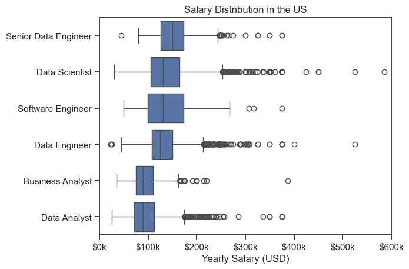
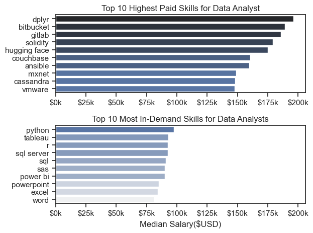

# The Analysis

## What are teh most demanded skills for the top 3 most popular data roles?

To find the most demanded skills for the top 3 most popular data roles, I filtered out those positions by which ones were the most popular, and got the top 5 skills for these top 3 roles. This query highlights the most popular job titles and their top skills, showing which skills I should pay attention to depending on the role I’m targeting.

View to my notebook with detailed steps here: [2.skill_counting.ipynb](project/2.skill_counting.ipynb)

### Visualize Data

```python
for i, job_title in enumerate(job_titles):
  df_plot = df_skills_perc[df_skills_perc['job_title_short']==job_title].head(5)
  sns.barplot(data=df_plot, x='skill_percent', y='job_skills', ax=ax[i], hue='skill_count', palette='dark:b_r')
  ax[i].set_ylabel('')
  ax[i].set_xlabel('')
  ax[i].get_legend().remove()
  ax[i].set_xlim(0, 78)

  for n, v in enumerate(df_plot['skill_percent']):
    ax[i].text(v+1, n, f'{v:.0f}%', va='center')

  if i != len(job_titles)-1:
    ax[i].set_xticks([])
```

### Result


### Insights

- Python is critical for Data Scientists and Data Engineers but less so for Data Analysts – Python appears in 72% of Data Scientist job postings and 65% of Data Engineer postings, making it the dominant programming language for these roles. However, for Data Analysts, it is only mentioned 27% of the time, suggesting it is less of a core requirement.
- SQL is the most universally required skill across all three roles – It appears in over half of job postings (51%) for Data Analysts and Data Scientists, and is also highly demanded (65%) for Data Engineers.
- Data Analysts rely more on Excel and Tableau for data visualization and reporting – Excel (41%) and Tableau (28%) are commonly listed for Data Analysts, reinforcing the need for strong data visualization and reporting skills in this role.
- Cloud and big data technologies are more important for Data Engineers – Skills like AWS (43%), Azure (32%), and Spark (32%) appear primarily in Data Engineer postings, highlighting the importance of cloud platforms and distributed computing in engineering roles.

# The Analysis

## 2. How are in-demand skills trending for Data Analysts?

### Visualize Data

```python
from matplotlib.ticker import PercentFormatter
ax = plt.gca()
ax.yaxis.set_major_formatter(PercentFormatter(decimals=0))

from adjustText import adjust_text

texts = []
for i in range(5):
    y_pos = df_plot.iloc[-1, i]

    # Move "Python" label down slightly
    if df_plot.columns[i] == "python":
        y_pos -= 2  # Adjust downward by 2 units (you can change this)

    texts.append(plt.text(11.2, y_pos, df_plot.columns[i]))
```

### Results


_Bar graph visualizing the trednding top skills for data analysts in the US 2023_

### Insights:

- SQL remains the most in-demand skill for data analysts in the US, consistently leading at above 50% throughout the year, though it shows a slight decline towards the end of the year.
- Excel holds a strong second position with a steady demand of around 40-45%, but it drops significantly toward the last quarter before rebounding in December.
- Tableau and Python are competing closely in the mid-tier range (~25-30%). Tableau sees a peak in August, whereas Python trends downward in the last quarter, possibly indicating a shift in preferred visualization or programming tools.
- SAS has the lowest demand among the top 5 skills, remaining stable around the 20% mark with minor fluctuations.

# The Analysis

## 3. How well do jobs and skill pay for Data Analysts?

### Salary Analysis for Data people

### Visualize Data
```python
sns.boxplot(data=df_US_top6, x='salary_year_avg', y='job_title_short', order=job_order)
sns.set_theme(style='ticks')
ticks_x = plt.FuncFormatter(lambda y, pos:  f'${int(y/1000)}k')
plt.gca().xaxis.set_major_formatter(ticks_x)
plt.show()
```

#### Results
*Box plot visualizing the salary distribution for the top 6 data job titles*


### Insights:
- Senior Data Engineer stands out with the highest median salary, followed by Data Scientist and Software Engineer. These roles also have wider salary ranges, suggesting variability based on experience or company.
- Business Analyst and Data Analyst have lower and more compact distributions, indicating less variation in salaries. These roles generally have lower median salaries than technical ones like engineering or scientist roles.
- 	Roles like Data Scientist, Data Engineer, and Senior Data Engineer show significant outliers, some approaching or exceeding $400k–$500k, hinting at high-paying opportunities in top tech firms or senior positions.

# The Analysis

## 4. How well do jobs and skill pay for Data
### Highest Paid and Most Demand Skills for Data
#### Visualize Data
```python
sns.barplot(data=df_DA_top_pay, x='median', y=df_DA_top_pay.index, ax=ax[0], hue='median', palette='dark:b_r')
ax[0].legend().remove()
#df_DA_top_pay[::-1].plot(kind='barh', y='median', ax=ax[0], legend=False)
ax[0].set_title('Top 10 Highest Paid Skills for Data Analyst')
ax[0].set_ylabel('')
ax[0].set_xlabel('')
ax[0].xaxis.set_major_formatter(plt.FuncFormatter(lambda x, pos: f'${int(x/1000)}k'))
plt.show()
```
*Two separated bar graphs visualizing the highest paid skills and most in-demand skills for data analysis in the US.*

### Insights:
- Rarer Technical Skills Pay More but Are Less Common
The highest-paid skills like dplyr, bitbucket, gitlab, solidity, and hugging face tend to be specialized or newer technologies, often used in fields like blockchain, software engineering workflows, or NLP. These skills are not widely listed in job postings, indicating that while they aren’t in high demand volume-wise, they are valued highly where needed—suggesting that scarcity and specialization drive up salaries.
- Common Skills Are Widely Required but Pay Less
Tools such as Excel, Word, and PowerPoint are among the most in-demand but are also associated with the lowest salaries. This suggests they are considered basic competencies for data analysts, rather than differentiating skills. 
- Python Strikes the Balance Between Demand and Value
Python stands out as the most in-demand skill while also offering competitive salaries, even if it doesn’t top the pay chart. Its versatility in data analysis, automation, and machine learning makes it a foundational tool across many roles. 